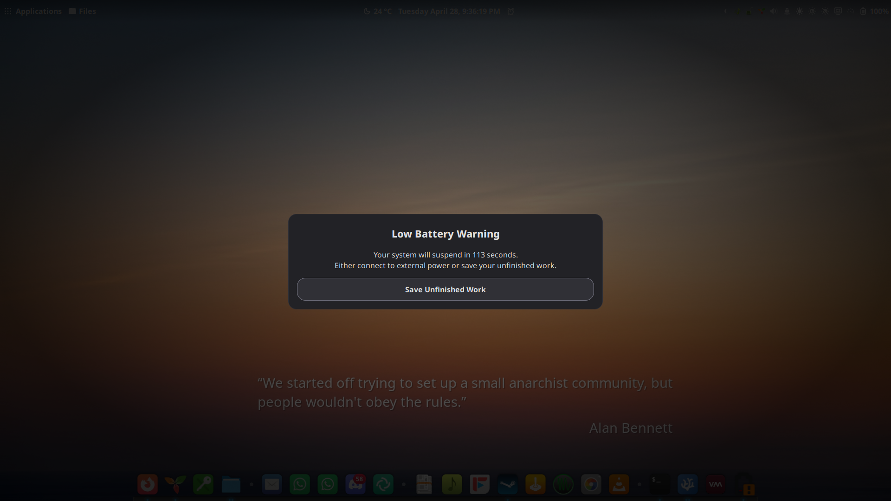

# Battery Guardian

**Battery Guardian** is a robust power-management extension for the Cinnamon Desktop Environment. It acts as a final safety net for your work, ensuring you never lose data due to an unexpected battery death.

Unlike standard system notifications that are easily missed, Battery Guardian provides a clear, persistent countdown when your battery reaches a critical level, giving you ample time to save your progress or plug in your charger.

**Requires Cinnamon 6.4 or newer.**

---

## Screenshot

---

## Key Features

* **Two-Stage Warning System** :
  * **Main Dialog** : A focused modal window that demands your attention when the battery hits the threshold.
  * **Floating Guardian** : If you choose to keep working, a non-intrusive floating window stays on top of all other windows (even in fullscreen) to keep you aware of the remaining time.
* **Audio Alerts** : Includes a looping alarm sound to ensure the warning isn't just seen, but heard.
* **Customizable Sounds** : Use the built-in alarm or select any custom `.ogg` or `.wav` file from your system.
* **Intelligent Cancellation** : The moment you plug in your AC adapter, all warnings, audio alerts and countdowns automatically disappear and the scheduled action is cancelled.
* **Customizable Battery Level** : Set exactly what battery percentage triggers the sequence. For best results, set it higher than the built-in system low-battery level.
* **Customizable Actions** : Choose whether the system should  **Shut Down** ,  **Suspend** , or  **Hibernate** .
* **Test Mode** : Safely verify the UI, audio, and timing without actually triggering a system power state change.

---

## Settings & Configuration

Access these options via **Menu > System Settings > Extensions**, then select **Battery Guardian** on the **Manage** tab and click the gear (⚙) button:

| Setting                       | Description                                                       | Default     |
| ----------------------------- | ----------------------------------------------------------------- | ----------- |
| **Battery Threshold**   | The percentage (%) at which the warning triggers.                 | `10%`     |
| **Action**              | What to do when time runs out (Power Off, Suspend, or Hibernate). | `Suspend` |
| **Countdown Duration**  | How many seconds you have to react before the action is forced.   | `120s`    |
| **Warning Sound**       | Select a custom audio file. Leave empty for the system default.   | `Default` |
| **Sound Loop Interval** | Adjust the repeat rate (in ms) to match your sound file's length. | `1000ms`  |
| **Test Mode**           | If enabled, the UI/Audio triggers but**no action**is taken. | `Off`     |

---

## Important Note on Hibernation

The **Hibernate** option is powerful because it saves your exact session to the hard drive, but **it is not supported by all Linux installations by default.**

Before selecting Hibernate as your default action, please verify your system supports it:

1. Open a terminal.
2. Run the command: `systemctl hibernate`
3. **If your computer does not turn off and successfully resume your session exactly where you left off, do not use this setting.**

> **Why?** Hibernation requires a swap partition or swap file that is at least as large as your RAM. If this isn't configured correctly, the command may fail, leaving your laptop to die ungracefully. If in doubt, use **Suspend (Sleep)** or  **Power Off** .

---

## Installation

### Method 1: Cinnamon Extension Download (Easiest)

1. Open  **Menu > System Settings > Extensions** .
2. Click the **Download** tab and update the cache.
3. Search for  **Battery Guardian** .
4. Click the  **Download icon** , then switch to the **Manage** tab and tick the checkbox to enable it.

### Method 2: Manual Installation

1. Create a folder named exactly `battery-guardian@beatlink`.
2. Place the project files inside that folder.
3. Move the folder to: `~/.local/share/cinnamon/extensions/`
4. Restart Cinnamon (`Alt+F2`, type `r`, then `Enter`).
5. Enable it under **Menu > System Settings > Extensions > Manage** .

---

## How it Works

When your battery drops below your defined threshold:

1. **The Alert** : A **Main Dialog** appears featuring a prominent message and a looping audio alert.
2. **The Choice** : You can click **"Save Unfinished Work"** (or hit `Esc`) to transform the modal into a small **Floating Window** in the bottom-right corner.
3. **The Workflow** : This allows you to continue saving files while the timer remains visible on top of all windows.
4. **The Action** : If the timer reaches  **0** , the system executes your chosen command.
5. **The Reset** : Plugging in power at any time kills the timer, stops the audio loop, and dismisses the UI immediately.

---

*Developed by BeatLink with AI assistance*

*[Icon created by Pop Vectors - Flaticon](https://www.flaticon.com/authors/pop-vectors)*
