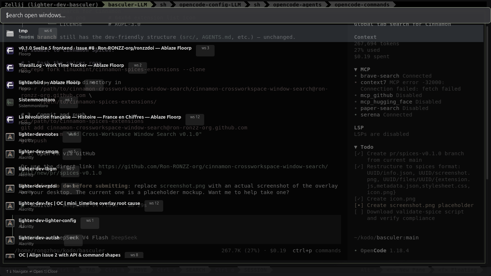

# Cross-Workspace Window Search

Full-screen global window search across all workspaces for Cinnamon Desktop.

Press `<Super>+<Ctrl>+<Alt>+Up` → type to filter → press Enter to jump. Never lose a window across your workspaces again.



## Features

- **Search all windows** across every workspace in real-time
- **Filter by title or application** — substring match, case-insensitive
- **Keyboard-driven** — arrow keys navigate, Enter opens, Escape closes
- **Full-screen overlay** — plenty of room for results, stays out of your way when dismissed
- **Workspace badges** — see at a glance which workspace each window belongs to
- **Zero panel clutter** — no dock icon, no applet. Invoked only on demand

## Requirements

- **Cinnamon Desktop** 5.x or later (Linux Mint 21.x / 22.x)
- Linux Mint 22.1 (Cinnamon 6.4) recommended

## Installation

Install via **System Settings → Extensions → Download tab**. Search for "Cross-Workspace Window Search" and install.

Or manually:

```bash
# Clone
git clone https://github.com/Ron-RONZZ-org/cinnamon-crossworkspace-window-search.git

# Symlink into Cinnamon's extensions folder
ln -sf "$(pwd)/cinnamon-crossworkspace-window-search@ron-ronzz-org.github.com/files/cinnamon-crossworkspace-window-search@ron-ronzz-org.github.com" \
  ~/.local/share/cinnamon/extensions/cinnamon-crossworkspace-window-search@ron-ronzz-org.github.com

# Enable in System Settings → Extensions → Cross-Workspace Window Search
```

## Usage

| Key | Action |
|-----|--------|
| `<Super>+<Ctrl>+<Alt>+Up` | Open search overlay |
| Type anything | Filter windows by title or app class |
| `↑` / `↓` | Navigate through results |
| `PgUp` / `PgDn` | Page through results |
| `Home` / `End` | Jump to first / last result |
| `Enter` | Switch to selected window |
| `Escape` | Close search overlay |

## How it works

The extension hooks into Cinnamon's window manager APIs (`Meta.Display`, `Meta.WorkspaceManager`) and Cinnamon's app tracker (`Cinnamon.WindowTracker`) to enumerate all open windows, fetch their icons and titles, and present them in a searchable full-screen overlay — all without any panel widgets or permanent UI.

## License

AGPL-3.0 — see [LICENSE](files/cinnamon-crossworkspace-window-search@ron-ronzz-org.github.com/LICENSE).
