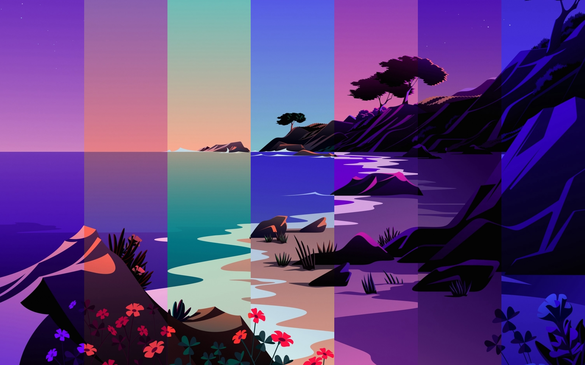
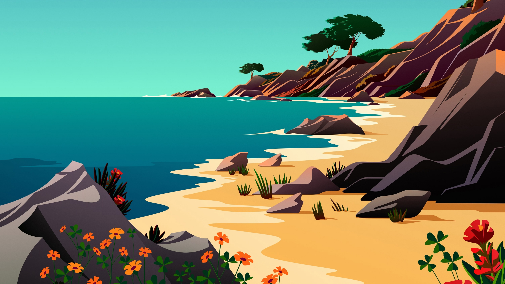

# Cinnamon Dynamic Wallpaper

## About the project
Based on a location, this extension calculates the periods of a day and switches the background image of your Cinnamon desktop. The extension offers the choice between a set of included wallpapers or to select a HEIC-file.

### Features
- 6 included image sets
- 9 day periods
- HEIF converter
- Image configuration assistent with simple one-click setup for image choose
- Online location estimation
- Offline sun angles estimation

### Tested Cinnamon versions
- 5.6

## Installation
### From the repo
1. Download the Repository
2. Extract the files
3. Copy the folder `cinnamon-dynamic-wallpaper@TobiZog` to `~/.local/share/cinnamon/extensions/`

### From Built-in Extension Manager
1. Open "Extensions" in Linux Mint or any other distribution with Cinnamon as Desktop Environment
2. Click on "Download"
3. Search and download it

## How to use it
1. Active the Extension via Cinnamon Extension Manager
2. Open the settings
3. Keep `Estimate coordinates via network` active or disable it and insert latitude and longitude in the fields
4. Choose a set of images or disable it and select for every daytime an image manually

## Image Configurator
The Cinnamon Dynamic Wallpaper extension offers an integrated image configuration assistant. Here, you can choose an included image set or import a HEIC-file from your system. You have to choose the images for the time periods after the import.

## Included image sets
The image sets are from https://github.com/adi1090x/dynamic-wallpaper

| Aurora | Beach | Bitday |
| ------ | ----- | ------ |
|  |  |  |

| Lakeside | Mountains | Sahara |
| -------- | --------- | ------ |
|  |  |  |