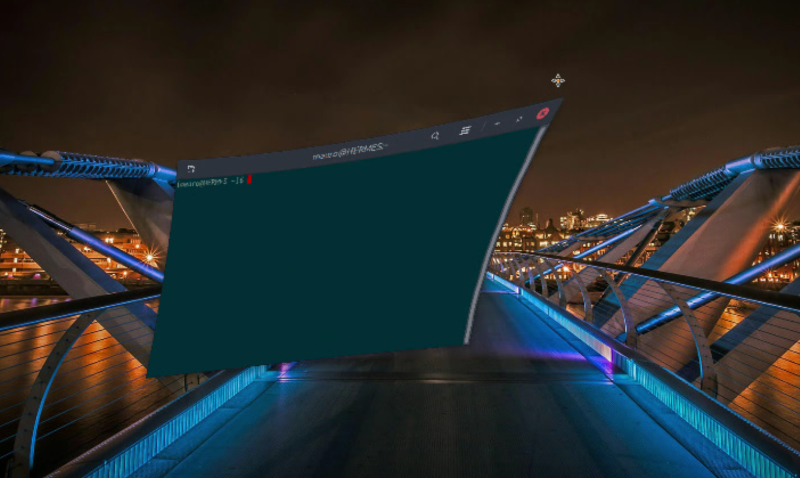

# Compiz windows effect

Compiz wobbly windows effect with compiz plugin engine.

[][repo]

## Prerequisite

Does NOT requires any external library.

## Installation

1. Coping the files/compiz-windows-effect@hermes83.github.com folder into ~/.local/share/cinnamon/extensions
2. Enable the extension in Cinnamon settings (plus button)