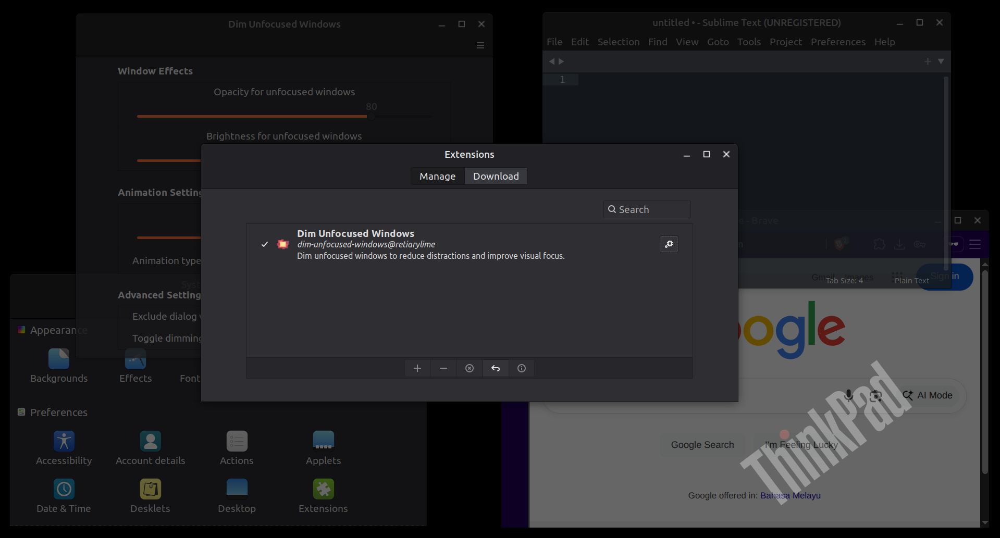

# Dim Unfocused Windows

A Cinnamon extension that automatically dims unfocused windows to enhance visual clarity and reduce distractions by making it easier to identify the active window.




## Features

1. **Automatic Dimming**: Windows automatically become semi-transparent when they lose focus
2. **Smooth Animations**: Configurable transition animations with multiple easing options for a polished experience
3. **Customizable Effects**: Adjust opacity (0-100%) and brightness (0-100%) levels to suit your preferences
4. **Smart Filtering**: Option to exclude dialog windows and system windows
5. **Performance Optimized**: Lightweight implementation with minimal system impact
6. **Keyboard Toggle**: Quick keyboard shortcut (default: Super+Shift+D) to temporarily disable/enable dimming
7. **Real-time Settings**: Changes to settings are applied immediately without restart
8. **Multi-Application Support**: Works seamlessly across Terminal, browsers, editors, and other applications

## Requirements

This extension requires Cinnamon 4.0 or better.

## Limitations

1. The dimming effect applies visual filters to window actors, which may interact differently with certain window types or themes
2. In some cases, window decorations or borders may not dim consistently with the window content
3. The brightness effect relies on Clutter's brightness/contrast effects, which may not be available in all Cinnamon versions (though supported versions should work fine)
4. Dialog windows are excluded by default to prevent issues with modal dialogs and file choosers, but it may be inconsistent in some cases

## Installation

<!-- This extension is available on Cinnamon Spices. It can be installed directly from within Cinnamon using the "Extensions" application under the "System Settings".

[Dim Unfocused Windows on Cinnamon Spices](https://cinnamon-spices.linuxmint.com/extensions/view/XXX) -->

For the latest development version, follow these instructions to install manually:

1. Clone the repository (or download the latest release by clicking the green "Code" button above, then "Download ZIP")
   
   ```
   git clone https://github.com/retiarylime/dim-unfocused-windows.git
   ```

2. If you downloaded a ZIP, extract it into a directory of your choice
   
   ```
   unzip ~/Downloads/dim-unfocused-windows-main.zip
   ```

3. Change directory to the cloned repository or extracted ZIP file

4. Copy or link the "dim-unfocused-windows@retiarylime" directory into the "~/.local/share/cinnamon/extensions/" directory
   
   ```
   cp -r $PWD/files/dim-unfocused-windows@retiarylime ~/.local/share/cinnamon/extensions/
   ```

5. Open the Cinnamon Extensions application (Menu → Preferences → Extensions)

6. Find "Dim Unfocused Windows" in the list and click the "+" button to enable it

7. Click the settings (gears) icon to open the settings panel and configure your preferences

## Settings

### Unfocused Window Effects
- **Opacity**: Control how transparent unfocused windows become (0-100%, default: 70%)
- **Brightness**: Adjust the brightness level of unfocused windows (0-100%, default: 70%)

### Animation Settings
- **Animation duration**: Set the speed of the dimming transition (0-1000ms, default: 300ms)
- **Animation type**: Choose from various easing curves (linear, quadratic, cubic) for smooth transitions

### Other Settings
- **Exclude dialog windows**: Prevent dimming of dialog boxes, file choosers, and preference windows
- **Toggle keybinding**: Set a keyboard shortcut to quickly enable/disable dimming (default: Super+Shift+D)

## How It Works

The extension monitors window focus changes using Cinnamon's built-in signals:
- When a window gains focus, all other windows are dimmed
- When a window loses focus, it gets dimmed unless it becomes the new focused window
- Window states are tracked to preserve original opacity values
- Smooth animations provide visual feedback during transitions

## Technical Details

- Uses `Meta.Display` focus signals for window tracking
- Leverages `Clutter.Actor` opacity manipulation for visual effects
- Implements `Clutter.BrightnessContrastEffect` for brightness control
- Utilizes `Tweener` for smooth animations
- Employs `Settings.ExtensionSettings` for configuration management
- Follows Cinnamon extension best practices for lifecycle management

## Troubleshooting

**Extension not working after installation:**
- Restart Cinnamon (Alt+F2, type 'r', press Enter)
- Check if the extension is enabled in Settings → Extensions
- Look for error messages in `~/.xsession-errors` or run `journalctl -f` while enabling

**Performance issues:**
- Reduce animation duration in settings
- Consider reducing the number of open windows to improve performance

**Windows getting minimized instead of dimmed:**
- This was fixed in v1.0 - ensure you're using the latest version
- Restart Cinnamon after updating (Alt+F2, type 'r', press Enter)

**Windows not restoring properly:**
- Disable and re-enable the extension
- Check for conflicts with other window management extensions
- Use the keyboard toggle (Super+Shift+D) to reset the extension state

**Settings not applying:**
- Changes should apply immediately, but you can restart Cinnamon if needed
- Check the extension logs in `~/.xsession-errors` for any errors

**Conflicts with other extensions:**
- If you have installed any window management or transparency-related extensions, ensure they don't conflict with Dim Unfocused Windows. You may need to disable them if you experience issues

## Feedback

Feel free to open an [issue](https://github.com/retiarylime/dim-unfocused-windows/issues) on this [GitHub repository](https://github.com/retiarylime/dim-unfocused-windows) if you want to make a suggestion or report a problem.

If you like this Cinnamon extension, "star" this GitHub repository to encourage continued development. Thanks!

## Credits

This extension was developed following Cinnamon extension development best practices and utilizes the standard Cinnamon APIs for window management and visual effects.

## License

This extension is released under the MIT License. See the [LICENSE](LICENSE) file for details.

## Contributing

Contributions are welcome! Please feel free to submit issues, feature requests, or pull requests.

## Changelog

See CHANGELOG.md for detailed version history.