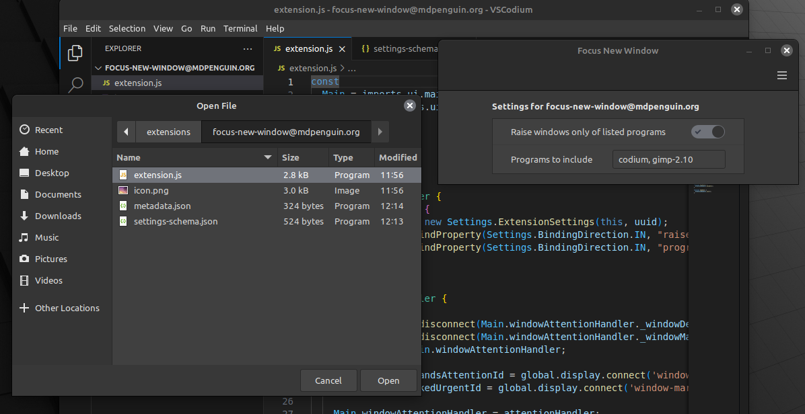

# Focus New Window

GNOME's handling of window focus to prevent focus-stealing has caused a lot of programs to open windows in the background rather than having them open in the foreground, focused and ready to be used ([bug report](https://gitlab.gnome.org/GNOME/mutter/-/issues/673)).  Unfortunately, this issue made its way into Cinnamon and affects a lot of commonly used programs, such as the file picker from VSCode.  This extension overrides the way that Cinnamon handles windows that are requesting attention so that they will be raised to the foreground and focused.

## Options
- Raise window only of listed programs
    - When selected, only windows from the programs that you list will be affected by the extension
    - When unselected, windows from all programs will be affected by the extension
- Programs to include
    - A comma separated list of programs to include
    - The list is not case sensitive and spaces between programs is optional

## Troubleshooting
- Issue: a listed program is not being focused
    - Double check that you have the right name
    - You can run `xprop WM_CLASS` in a terminal to see what name is being used by the window that you are trying to include