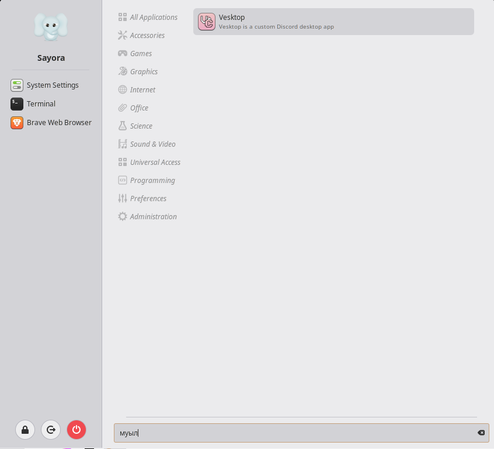

# Keyboard layout search

Find applications in the Cinnamon menu by the **keys you pressed**, not by the characters your active keyboard layout produced.

You press Super, type `vesk` to launch Vesktop, and get nothing — because the Russian layout was still active and what actually reached the menu was `муыл`. Same physical keys, different characters, no match. This extension retypes your query into every layout you have enabled and searches for those spellings too.

## How it works

The key mapping is **not** a hardcoded us↔ru table. It is read from the live X keymap: every hardware keycode is walked and each `(keycode, group, level)` slot is recorded along with the character it produces. That gives both directions at once — character to physical key, and physical key to character in another layout group.

Consequences:

- Any pair of layouts works, not just Latin and Cyrillic. Greek, Armenian, Hebrew, kana — all of them are just other groups on the same keys.
- Adding or removing a layout takes effect immediately; the table is rebuilt on the keymap's `keys-changed` signal.
- There is nothing to configure per language and nothing to keep updated.

Matching hooks into the menu applet's own `_listApplications()`. The original runs first and reports what matched as typed; the extension then scans the same button list for the retyped spellings and appends whatever it missed. So:

- results are genuine application buttons — right-click menus, drag-to-favourites and icons all keep working;
- they are ranked on the applet's own scale and slot in *after* every match found in the layout you actually typed in, rather than being pinned to the bottom;
- nothing is written to your `.desktop` files, and no separate application index is maintained.

## Settings

| Setting | Default | |
| --- | --- | --- |
| Minimum query length | 2 | Very short queries, once retyped, match almost everything. |
| Maximum extra results | 6 | Only limits wrong-layout matches; native matches are never trimmed. |
| Only search other layouts when the menu found nothing | off | Shorter lists, at the cost of hiding a wrong-layout match when the query also matches something natively. |
| Application keywords | on | Fields searched, matching what the menu itself searches. |
| Application descriptions | on | Long, so they match more loosely than names. |
| Desktop file names | on | Matches things like `dev.vencord.Vesktop.desktop`. |

## Requirements

Cinnamon 6.0 or newer, and the stock menu applet (`menu@cinnamon.org`). Other menu applets are untouched.

## License

GPL-3.0. See [LICENSE](files/keylayout-search@S4Y0R4/LICENSE).
