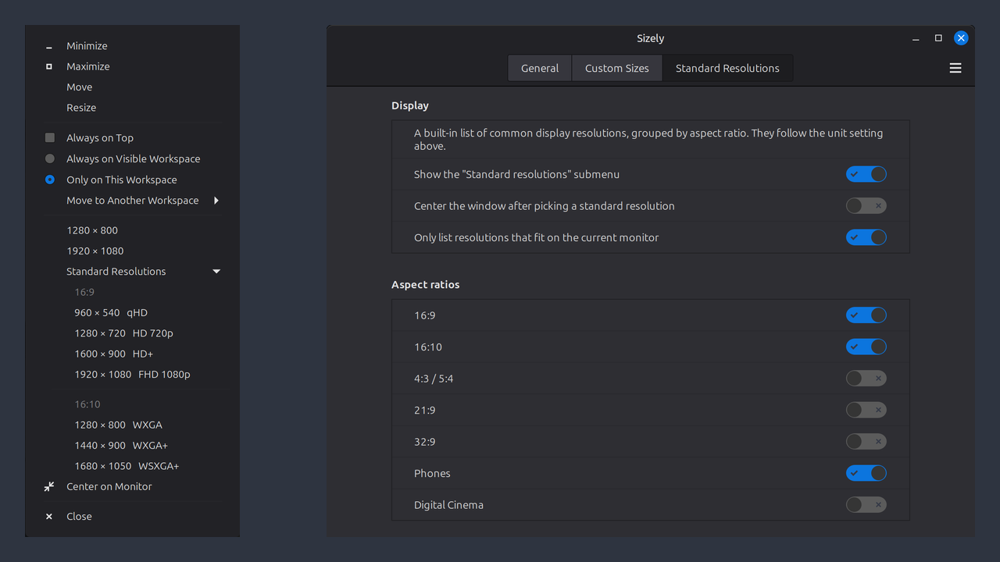

# Sizely

Put a window at a set size — and in the middle of the screen — straight from the
title bar menu.



Right-clicking a title bar gains two entries: your own sizes, and a list of the
common display resolutions grouped by aspect ratio. Centering happens on the
monitor the window actually sits on, with the panel offset taken into account.

## Features

* **Custom sizes** — as many as you like, each with a name, width, height and an
  optional "center" flag. Shown either grouped in a "Size" submenu or listed
  directly in the window menu; with only a couple of them, listing them directly
  saves a click.
* **Standard resolutions** — a built-in list from qHD to 8K plus common phone
  viewports, grouped by aspect ratio. 16:9, 16:10 and Phones are on out of the
  box; 4:3 / 5:4, 21:9, 32:9 and Digital Cinema can be switched on. Only sizes
  that fit the current monitor are listed.
* **Center on monitor** — puts the window in the middle without changing its
  size. Default shortcut <kbd>Super</kbd>+<kbd>Shift</kbd>+<kbd>C</kbd>.
* **HiDPI aware** — sizes can be given in logical or physical pixels. Logical
  multiplies by the UI scaling factor, so "1920 × 1080" covers the area a Full HD
  screen would.

## Why not wmctrl or xdotool

Sizely works through the Muffin API (`get_work_area_current_monitor()` and
`move_resize_frame()`), so the panel offset, the monitor boundaries on
mixed-resolution setups and the frame geometry including the title bar all come
out right. Tools that compute against the virtual combined screen do not know
where one monitor ends and the next begins — centering would drop a window on
the seam between two displays.

## Settings

*System Settings → Extensions → Sizely → gear icon*, or:

```bash
xlet-settings extension sizely@gossardla
```

Three tabs: **General** (window menu, unit, shortcut), **Custom Sizes** (your own
entries) and **Standard Resolutions** (which aspect ratios to offer).

## Requirements

Cinnamon 6.0 – 6.6 on X11.

## Links

Source, issues and the full documentation:
<https://github.com/lasse-tech/sizely>

## License

MIT — see `files/sizely@gossardla/LICENSE`.
