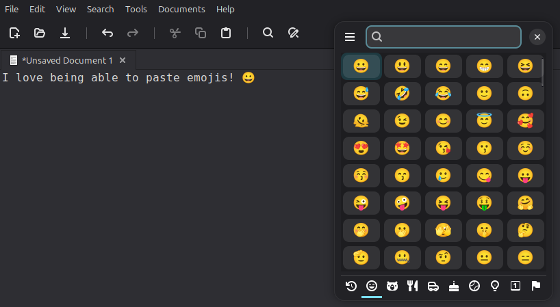

# Smile Autopaste

A Cinnamon extension that automatically pastes emojis selected in [Smile](https://github.com/mijorus/smile) into the previously focused window.

## How it works

When you pick an emoji in Smile, Smile copies it to the clipboard and emits a D-Bus signal. This extension listens for that signal and replays `Ctrl+V` into the previously focused window after a short delay, so the emoji lands where the user's cursor was.

## Requirements

- [Smile](https://github.com/mijorus/smile) emoji picker must be installed and running.

## Installation

Clone this repository and copy `files/smile-autopaste@turtl.cc` into `~/.local/share/cinnamon/extensions/`.
