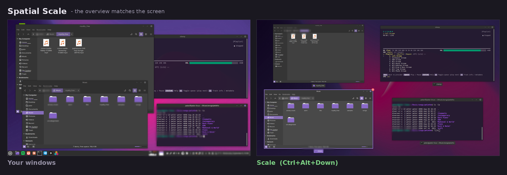

# Spatial Scale

A Cinnamon extension that makes the Scale overview - all windows spread out,
`Ctrl+Alt+Down` by default - place each window where it actually is on screen.

Cinnamon builds a square grid of slots and hands them out by array index. That
array is sorted by *stacking order*, so a window in the
bottom-right of your screen can land in the top-left of the overview, and the
order shuffles as you raise windows. This de-coupling of positions is confusing. No more!

This extension keeps Cinnamon's grid geometry and changes only which window
goes in which cell, choosing the arrangement that minimises the total distance
between where each window really is and where its cell sits.

## Before / after



Same four windows, same positions - the overview is the screen, scaled down.

Schematically:

Two windows stacked on the left, one large window on the right:

```
screen                    stock Scale               Spatial Scale

┌─────────┬─────────┐     [    B    ][    C    ]    [    A    ][    C    ]
│    A    │         │          [    A    ]          [    B    ]
├─────────┤    C    │
│    B    │         │     arbitrary order, and      matches the screen,
└─────────┴─────────┘     A is centred in the       and the gap is where
                          last row                  the screen's gap is
```


## Install

```sh
git clone https://github.com/petterthowsen/cinnamon-spatial-scale.git \
    ~/.local/share/cinnamon/extensions/spatial-scale@petterthowsen
```

Then enable **Spatial Scale** in *System Settings → Extensions*. No restart
needed. There are no settings.

## How it works

Three steps, all inside a wrapper around
`WorkspaceMonitor.prototype._computeAllWindowSlots`:

1. **Build every grid cell, not just the occupied ones.** Cinnamon generates
   exactly `n` slots and re-centres the leftovers in the last row, which drags
   a bottom-left window into the middle. Offering all `gridWidth × gridHeight`
   cells lets the unused ones stay empty, so windows keep their real column.

2. **Cost each window against each cell** by squared distance between centres,
   normalised into the layout area. Horizontal distance is weighted by the
   area's aspect ratio, so on a 16:9 screen a sideways gap costs what it
   geometrically should instead of being flattened by the normalisation.

3. **Solve the assignment** with the Hungarian algorithm (O(n³)), padding the
   matrix to a square with zero-cost dummy rows — the cells those claim are the
   ones left empty.

Ties are common: two windows sharing an x are equidistant from the two cells in
a row, and the solver would break that arbitrarily, swapping them vertically for
no reason. A reading-order preference weighted at `1e-6` settles those. That is
several orders of magnitude below any distance difference you could see, so it
only ever decides exact ties.

Above 64 windows it falls back to banding windows into rows by vertical centre
and sorting each row by horizontal centre — `O(n log n)`, and Scale is unusable
at that size anyway. Any unexpected input (a clone without a `metaWindow`, a
zero-size layout area, a thrown exception) returns Cinnamon's original slots, so
the worst case is stock behaviour rather than a broken overview.

## Known limitations

- **The grid is still a grid.** Three windows side by side across the top become
  `[A][B]` / `[ ][C]`, because a 2×2 grid has no third column. Representing that
  faithfully means dropping the grid for a natural layout (real relative
  positions, scaled and repelled until nothing overlaps), which is a different
  and larger change.
- **All cells are the same size.** A narrow terminal and a maximised browser get
  identical slots; only position is spatial, not size.
- **Keyboard navigation in Scale** (`GridNavigator`, arrow keys) still walks the
  underlying stacking-order array, so arrow keys don't follow what you see.
- **Expo is untouched.** `positionWindows` returns early when Expo is visible,
  and Expo uses a separate implementation in `expoThumbnail.js`.

## Tests

The layout logic is pure and runs outside Cinnamon —
`tests/load.js` stubs `imports.ui.workspace` and loads `extension.js` directly.

```sh
node tests/test.js      # assertions
node tests/layouts.js   # prints the grid for a few hand-built layouts
```

`tests/test.js` checks the assignment against brute-force enumeration of every
injective window→cell mapping for small window counts, so optimality is verified
rather than assumed. It also covers the last-row regression, tie determinism,
the headroom between the tie-break weight and real distances, validity of both
code paths up to 120 windows, degenerate inputs, and cost (~0.6 ms at the
64-window cap, against a 250 ms animation).

## Compatibility

Written against Cinnamon 6.6, declared for 6.0–6.8. It depends on two internal
details — that `_computeAllWindowSlots` returns `[xCenter, yCenter, xFraction,
yFraction]` tuples, and that `this._windows` is in the index order
`positionWindows` consumes. Both have been stable for years, but they are not
public API, and a Cinnamon release could change them.

## Licence

GPL-2.0-or-later — see [LICENSE](LICENSE).
