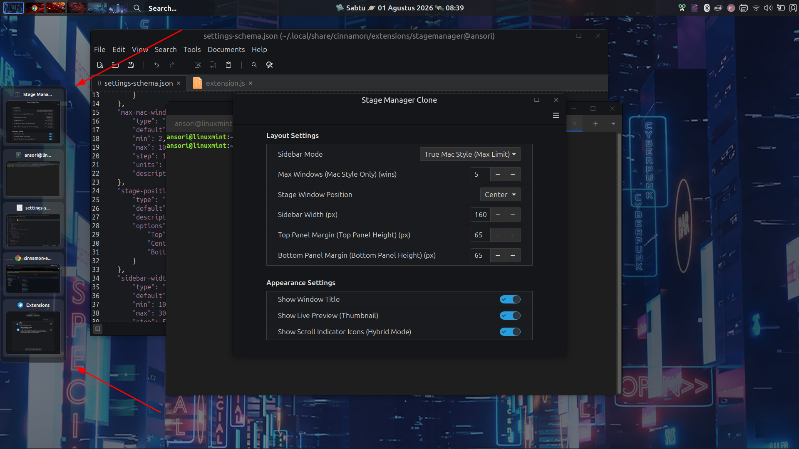

# Stage Manager Clone - Cinnamon Extension

A macOS-like Stage Manager extension for Linux Cinnamon, allowing you to manage and preview your opened windows in a sleek sidebar on the left side of your screen.

## Screenshot

## Features

* **Live Window Previews:** Displays real-time clones/thumbnails of opened applications in your active workspace.
* **Smart Auto-Hide:** Automatically hides when applications are maximized or when configured to auto-hide via mouse hover.
* **Customizable Settings:** Easily adjust sidebar width, top/bottom panel margins, and toggle title/thumbnail visibilities.
* **Workspace & Window Awareness:** Automatically hides itself if there are fewer than 2 windows open in the active workspace.
* **Multi-Window Navigation:** Click any thumbnail to instantly bring that window to focus.

## Configuration

You can configure the extension by clicking the gear icon next to it in the Cinnamon Extensions menu. Available settings (fully in English) include:
* **Sidebar Width:** Adjust the width of the sidebar.
* **Top Panel Margin:** Adjust the offset to fit beneath your top panel.
* **Bottom Panel Margin:** Adjust the offset for any bottom panels.
* **Show Window Title:** Toggle the app title text on or off.
* **Show Live Preview (Thumbnail):** Toggle live window thumbnails on or off.

## Requirements

* Linux Mint / Cinnamon Desktop Environment (Compatible with modern Cinnamon versions).

## License

This project is open-source and free to use for personal customization.

---
*Created for the Cinnamon Desktop Environment.*
