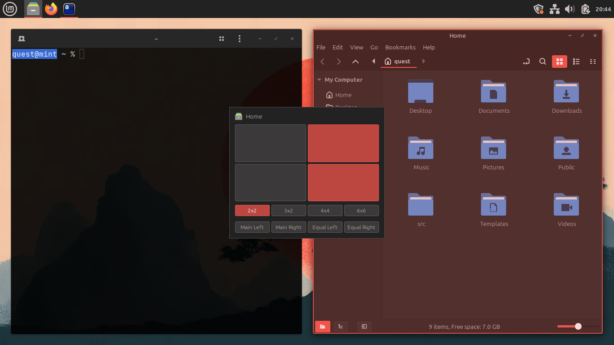

# Tiler

Grid-based window tiling for Cinnamon, with configurable gaps and reserved
screen space.

Press the hotkey (default `<Super>T`), pick a cell range on the grid overlay,
and the focused window snaps into place. Cinnamon's own tiling shortcuts,
`<Super>` with an arrow key, keep working as they always have, now leaving
the gaps and keeping off the reserved space. Inspired by gTile, rebuilt from
scratch for modern Cinnamon.

## Features

- **Interactive grid overlay**: toggled with `<Super>T` (configurable), shown
  in the middle of the screen or over the window itself if you prefer, and
  headed by the icon and title of the window it will move.
- **Mouse control**: hover a cell to see where the window would go, click to
  put it there, or drag across the grid to give it a range of cells.
- **Keyboard control**: arrows move the selection, `Shift`+arrows extend it,
  `1`-`4` switch grids, `L` and `R` auto-tile a main window to that side
  (`Shift` makes it the equal split instead), `Enter`/`Space` tile the
  window, `Escape` closes the overlay.
- **Cinnamon's own tiling shortcuts**: `<Super>` with an arrow key goes on
  doing what it always did: half the screen, then the corners, then the whole
  screen, and back out again. The only difference is where the windows land;
  they are placed like everything else Tiler places, leaving the gaps and
  keeping off the reserved space. Turn it off to leave those shortcuts to
  Cinnamon.
- **Grid presets**: four configurable grids, switched from a selector on the
  overlay or with `1`-`4`. Columns and rows can be given different sizes: one
  of the grids you start with is three columns with a double-width one in the
  middle, for a wide window between two narrow ones. Each grid can be given a
  name and a description of its own.
- **Auto-tile**: one press arranges every window on the workspace at once:
  a main window beside the rest, or everything shared out equally, either
  way led from whichever side you prefer. Every window after the first
  halves the largest cell rather than adding a row, so cells stay even and
  keep the shape of the screen. A window that cannot shrink into its cell is
  given a larger one instead, and one that fits nowhere is left where it was,
  minimized, centered, or cascaded, whichever you choose. Minimized windows
  are left alone; buried ones are dug out and given a place. Auto-tiled
  windows honor the same gaps and reserved space as everything else, and the
  action row can be hidden if you never use it.
- **Window spacing**: pixel-perfect gaps, configured separately for
  window-to-window and window-to-screen-edge. Adjacent windows get exactly
  the configured gap (no doubled inner gaps). Neither kind of gap takes up
  more than a quarter of the space available to it, so gaps shrink to fit on
  dense grids and small screens rather than squeezing windows out.
- **Reserved space**: keep pixels at the top, bottom, left, or right of the
  screen permanently tile-free; ideal for Conky or docks such as Plank
  Reloaded that don't reserve struts. Applies to all monitors or the primary
  monitor only, and is honored exactly as configured: if that leaves too
  little room to tile into, Tiler leaves windows where they are.
- **Tiles what you expect**: ordinary application windows by default, with
  dialogs and floating toolboxes available as options.
- **Multi-monitor aware**: the grid appears on the monitor holding the
  window being tiled, and works from that monitor's own usable area. Send a
  window to another monitor or workspace with Cinnamon's own shortcuts and
  the grid follows it there.
- **True maximize**: choosing the whole grid genuinely maximizes the window
  rather than merely covering the screen, so long as no gaps or reserved
  space are asked for, since a maximized window fills everything left to it.

## Requirements

- Cinnamon 6.0 or newer
- `gettext`, to compile the translations when installing from the repository

## Installation

### From the Spices store

Install from **System Settings → Extensions**: select the **Download** tab
and search for "Tiler".

### From this repository

Tiler can also be installed straight from this repository, which is how to
run it before it reaches the store, or to try changes that have not
shipped yet:

    cd tiler@zquestz
    ./install.sh

The extension and its translations go to the same places the store puts
them, so installing from System Settings later takes this copy over
cleanly. Enable Tiler in **System Settings → Extensions** afterwards.

    ./install.sh --uninstall

removes it again. Your settings are left where they are, so installing it
once more finds the grids and spacing you had before.

## Development

Tiler is written in TypeScript. The sources live in `src/`; the shipped
`files/tiler@zquestz/tiler.js` bundle is generated and must never be edited
by hand.

    npm install
    npm run build

`npm run build` type-checks the sources with `tsc` and then bundles them
with esbuild. `npm run check` runs the type check alone; `npm run watch`
rebuilds the bundle on every source change.

    npm test

The pure arithmetic, from working out rectangles to sharing out space, is
covered by tests that run on Node's own test runner and need nothing beyond
the packages above.

To try the result, install a development copy from the repository root:

    ./test-spice tiler@zquestz

This installs the extension as "(devtest) Tiler", so it can be enabled
alongside a released version of Tiler. That is the difference between the
two: `install.sh` installs Tiler itself, while a devtest copy keeps its own
settings and sits beside the real thing.

## Acknowledgements

Tiler was inspired by
[gTile](https://github.com/linuxmint/cinnamon-spices-extensions/tree/master/gTile%40shuairan)
by shuairan (itself descended from the GNOME gTile extension).

## License

GPL-3.0
