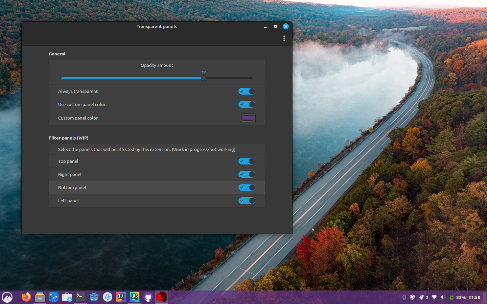
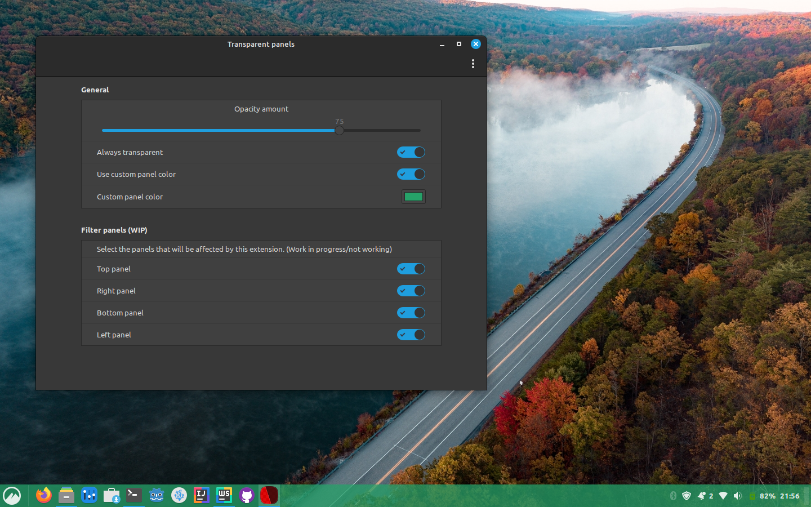
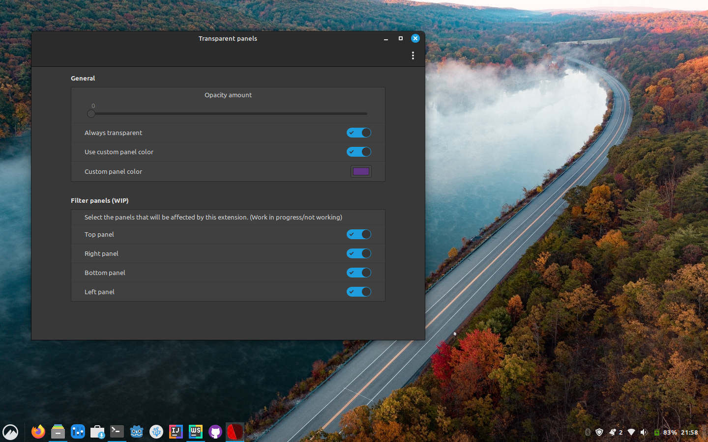
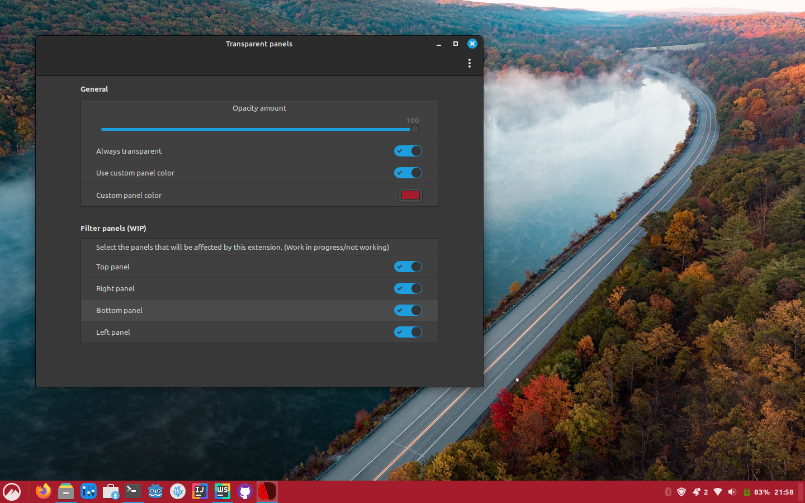

# [Transparent panels reloaded - A Cinnamon extension][repo]

Make your panels transparent (or not) and change their color as you wish.

[repo]

[repo]

[repo]

[repo]

## Installation

### Cinnamon Spices

Download it [from here][spices] or search for _"Transparent panels reloaded"_ in your Cinnamon extension settings.

### From source

To download the source and install it, execute the following as a normal user (you will
need [git](https://git-scm.com/)).

``` shell
$ git clone https://github.com/marcelovbcfilho/cinnamon-transparent-panels-reloaded.git
$ cd cinnamon-transparent-panels-reloaded/ && ./utils.sh install
```

The above will download the source from Github and it will be copied to your `~/.local/share/cinnamon/extensions/`
folder. If you don't have git installed, you can download a
zip [from here](https://github.com/marcelovbcfilho/cinnamon-transparent-panels-reloaded/archive/master.zip), extract it
and run `$ ./utils.sh install`.

## Changelog

See the list of changes on
Github:  [https://github.com/marcelovbcfilho/cinnamon-transparent-panels-reloaded/commits/master][commits]

## Issues

If you find any bug you can file an issue in the Github project
page: [https://github.com/marcelovbcfilho/cinnamon-transparent-panels-reloaded/issues][issues]

Make sure you have an updated version of Cinnamon and try to explain the more detailed you can what the problem is (
don't just say _"it doesn't work"_ because that doesn't help at all).

Please, do not post issues in the comments of the Cinnamon Spices website because it doesn't have a notification system
and I rarely see it.

## Contributing

Contributions are welcome, also in form of translations. Please, submit pull requests [to the repository][repo] not the
spices repository, which is only a distribution channel (not even a mirror). What is in there is automatically generated
and overwritten.

If you have any questions about the extensions api you can find some help [HERE](https://github.com/linuxmint/Cinnamon/wiki/%5Bdevelopment%5D-extensions)

## FAQ

#### 1) Is it possible to keep transparency always?

Yes, but you don't need this extension to do that. You can remove the background of your panels in the
theme's `cinnamon.css`, and it will probably work better.

#### 2) System warns this extension isn't compatible with the current version of Cinnamon.

Load it anyways. I have to update the list of compatible versions each time a new version is released, so I may have
missed it but probably it still works. If it doesn't, please file an [issue][issues].

#### 3) It doesn't work!

First, make sure you have the latest version of Cinnamon (or at least not a prehistoric one). I do not mantain backwards
compatibility for too long, but I mark some points in time when the extension worked for that version. If you have an
old version, find [here][releases] a release that is compatible with your version of Cinnamon and install it manually.
If it still doesn't work or you already had an updated version, please file an [issue][issues].

## License

This extension is free software and it's licensed under GPL3.
You should have received an unobfuscated copy of the source code. If you don't, you can get it
on [https://github.com/marcelovbcfilho/cinnamon-transparent-panels-reloaded][repo]

```
Transparent panels reloaded - Cinnamon desktop extension
Make your panels transparent (or not) and change their color as you wish
Copyright (C) 2022 Marcelo Vilas Boas Correa Filho

This program is free software: you can redistribute it and/or modify
it under the terms of the GNU General Public License as published by
the Free Software Foundation, either version 3 of the License, or
(at your option) any later version.

This program is distributed in the hope that it will be useful,
but WITHOUT ANY WARRANTY; without even the implied warranty of
MERCHANTABILITY or FITNESS FOR A PARTICULAR PURPOSE.  See the
GNU General Public License for more details.

You should have received a copy of the GNU General Public License
along with this program.  If not, see <http://www.gnu.org/licenses/>.
```

[repo]: https://github.com/marcelovbcfilho/cinnamon-transparent-panels-reloaded

[commits]: https://github.com/marcelovbcfilho/cinnamon-transparent-panels-reloaded/commits/master

[issues]: https://github.com/marcelovbcfilho/cinnamon-transparent-panels-reloaded/issues

[releases]: https://github.com/marcelovbcfilho/cinnamon-transparent-panels-reloaded/releases

[spices]: https://cinnamon-spices.linuxmint.com/extensions/view/42
