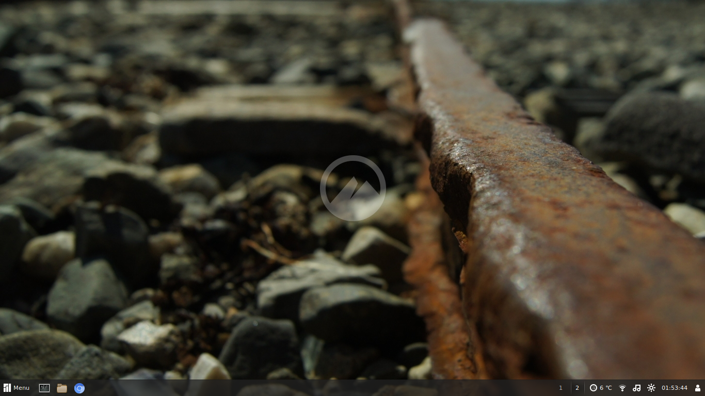

# Watermark - A Cinnamon extension

Place a watermark on the desktop

[][repo]

## Included watermarks
 * Cinnamon
 * Manjaro
 * Manjaro Text (Manjaro logo with text)
 * Arch
 * All Gtk icons, including *start-here*
 * Virtually **any image from a custom location**

## Changelog
See the list of changes on Github:  [https://github.com/germanfr/watermark-cinnamon/commits/master][commits].

## Issues
If you find any bug you can file an issue in the Github project page: [https://github.com/germanfr/watermark-cinnamon/issues][issues].

Make sure you have an updated version of Cinnamon and try to explain the more detailed you can what the problem is (don't just say _"it doesn't work"_ because that doesn't help at all).

Please, do not post issues in the comments of the Cinnamon Spices website because it doesn't have a notification system and I rarely see it.

## License
This extension is free software and it's licensed under GPL3.
You should have received an unobfuscated copy of the source code. If you don't, you can get it on [https://github.com/germanfr/watermark-cinnamon][repo].

The included watermark logos are property of their creators. They are not part of this program, so this license doesn't apply to them unless otherwise specified. See the ATTRIBUTIONS file.

```
Watermark - Cinnamon desktop extension
Place a watermark on the desktop
Copyright (C) 2018  Germán Franco Dorca

This program is free software: you can redistribute it and/or modify
it under the terms of the GNU General Public License as published by
the Free Software Foundation, either version 3 of the License, or
(at your option) any later version.

This program is distributed in the hope that it will be useful,
but WITHOUT ANY WARRANTY; without even the implied warranty of
MERCHANTABILITY or FITNESS FOR A PARTICULAR PURPOSE.  See the
GNU General Public License for more details.

You should have received a copy of the GNU General Public License
along with this program.  If not, see <http://www.gnu.org/licenses/>.
```

[repo]: https://github.com/germanfr/watermark-cinnamon
[commits]: https://github.com/germanfr/watermark-cinnamon/commits/master
[issues]: https://github.com/germanfr/watermark-cinnamon/issues
[releases]: https://github.com/germanfr/watermark-cinnamon/releases
