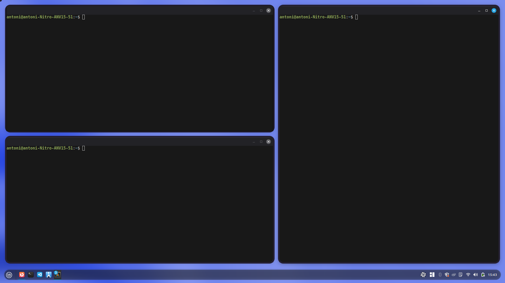

# Window Borders

Adds a customizable colored border around every window in Cinnamon.

## Features

- Colored border around all application windows
- Adjustable width (1px – 20px)
- Adjustable border radius (0px – 30px)
- Custom color picker
- Option to hide borders on maximized windows
- Configurable from System Settings → Extensions

## Screenshot

## Requirements

- Cinnamon 6.6 or newer

## Installation

Install from System Settings → Extensions, or from [cinnamon-spices.linuxmint.com](https://cinnamon-spices.linuxmint.com).
